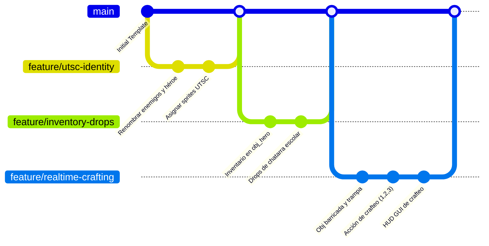

# Plan de Implementación — Zombies Arena (UTSC Edition)

Este plan de desarrollo detalla los pasos necesarios para transformar la plantilla base en un videojuego zombie-survival ambientado en la Universidad Tecnológica Santa Catarina, con mecánicas de crafteo escolar en tiempo real, tematización de enemigos y persistencia.

---

## Estrategia de Ramificación en Git

GameMaker Studio 2 guarda la configuración de recursos en archivos `.yy` y el archivo del proyecto `.yyp`. Estos archivos XML/JSON son extremadamente propensos a **conflictos de fusión (merge conflicts)** difíciles de resolver si dos desarrolladores modifican el árbol de recursos al mismo tiempo.

Para evitar conflictos, utilizaremos una estrategia de ramas aisladas por características específicas:



### Reglas para evitar conflictos en GameMaker:
1. **Comunicaciones previas:** Antes de crear nuevos recursos (sprites, objetos, scripts) en el Asset Browser de GameMaker, asegúrate de que tu rama esté actualizada con `main`.
2. **Commit del archivo `.yyp` por separado:** Siempre que agregues un objeto o sprite nuevo, GameMaker modificará `Zombie Arena.yyp`. Haz commits pequeños de estas adiciones.
3. **No editar el mismo asset:** Evita que dos ramas modifiquen el mismo objeto o script al mismo tiempo.

---

## Hito 1: Identidad UTSC (Rama: `feature/utsc-identity`)
**Objetivo:** Cambiar la estética y nombres genéricos de la plantilla por la temática de la UTSC (Nerd vs. Estudiantes/Profesores Zombies).

- [ ] **Tarea 1.1: Configuración del Protagonista (Nerd)**
  - Reemplazar las asignaciones de sprites en `obj_hero` por los sprites del estudiante nerd (caminata, idle, hit) que se encuentran en el directorio `/hero`.
- [ ] **Tarea 1.2: Tematización de Enemigos**
  - Renombrar conceptualmente y asociar sprites en los eventos `Create` de los enemigos:
    - `obj_pumpkill` -> **Estudiante Zombie** (Velocidad media, vida baja, drop: Regla).
    - `obj_pigun` -> **Docente/Profesor Zombie** (Velocidad media-alta, vida media, drop: Lápiz/Grapa).
    - `obj_rooster` -> **Personal Administrativo Zombie** (Velocidad baja, vida alta, drop: Tijera).
- [ ] **Tarea 1.3: Ambientación de la Arena (UTSC)**
  - Editar el mapa/room `rm_game` para usar elementos de decoración de la universidad (buses escolares, aulas, chatarra) y modificar el fondo tiled para adaptarlo al patio de la UTSC.

---

## Hito 2: Inventario y Drops de Chatarra Escolar (Rama: `feature/inventory-drops`)
**Objetivo:** Crear el sistema de recursos que el jugador recogerá al derrotar enemigos.

- [ ] **Tarea 2.1: Inicialización del Inventario**
  - En el evento `Create` de `obj_hero`, inicializar un struct de inventario:
    ```gml
    inventory = {
        reglas: 0,
        lapices: 0,
        tijeras: 0,
        grapas: 0,
        cafe: 0
    };
    ```
- [ ] **Tarea 2.2: Creación del Objeto Drop (`obj_loot_material`)**
  - Crear un nuevo objeto `obj_loot_material` que reemplace a `obj_collectable` para ciertos drops.
  - El objeto debe tener un tipo de recurso asignado (ej. `"regla"`, `"lapiz"`) y cambiar su sprite en consecuencia.
- [ ] **Tarea 2.3: Modificar Drops al Morir Enemigos**
  - Editar `obj_enemy` (evento `Destroy`) para que, al morir, suelte chatarra específica según su tipo en lugar de gemas de XP tradicionales:
    - Zombie Normal -> Suelta `obj_loot_material` tipo `"regla"` (100% de probabilidad) o `"lapiz"` (50%).
    - Zombie Corredor -> Suelta `obj_loot_material` tipo `"lapiz"`.
    - Zombie Tanque -> Suelta `obj_loot_material` tipo `"tijera"`.
    - Zombie Tóxico -> Suelta `obj_loot_material` tipo `"grapa"`.
    - Boss -> Suelta `obj_loot_material` tipo `"cafe"`.
- [ ] **Tarea 2.4: Recolección y Suma al Inventario**
  - En `obj_hero`, añadir un evento de colisión con `obj_loot_material`:
    - Leer el tipo de material del objeto colisionado.
    - Sumarlo al struct de inventario del héroe.
    - Reproducir un sonido de recolección escolar y destruir el objeto de material.

---

## Hito 3: Crafteo en Tiempo Real (Rama: `feature/realtime-crafting`)
**Objetivo:** Permitir al jugador fabricar elementos defensivos sin pausar la acción, consumiendo materiales.

- [ ] **Tarea 3.1: Objeto Barricada (`obj_barricade`)**
  - Crear el objeto `obj_barricade` con un sprite de banco/escritorio escolar apilado.
  - Asignarle puntos de vida (ej. 50 HP).
  - Programar colisión con enemigos: los enemigos deben detenerse y atacarlo en lugar de seguir directamente al jugador, restando vida a la barricada. Al llegar a 0 HP, la barricada se destruye.
- [ ] **Tarea 3.2: Objeto Trampa (`obj_trap`)**
  - Crear el objeto `obj_trap` (ej. trampa de grapas o tijeras).
  - Al colisionar con un enemigo, hacer daño masivo (ej. 100 de daño) al primer enemigo que la pise y destruirse de inmediato.
- [ ] **Tarea 3.3: Lógica de Fabricación e Inputs**
  - En el evento `Step` de `obj_hero` (solo si el juego no está pausado), detectar entradas de atajo:
    - **Tecla 1 / Botón A:** Craftear Barricada. Costo: 2 reglas, 1 lápiz. Crea `obj_barricade` en la posición actual.
    - **Tecla 2 / Botón B:** Craftear Trampa. Costo: 2 tijeras, 3 grapas. Crea `obj_trap` en la posición actual.
    - **Tecla 3 / Botón X:** Consumir Café. Costo: 1 café. Cura 25 HP al héroe (sin pasar el tope `hitpoints_max`).
  - Añadir validaciones de costos: si no tiene los materiales necesarios, reproducir sonido de error y mostrar texto emergente flotante con `obj_text_popup`.
- [ ] **Tarea 3.4: HUD de Crafteo (Draw GUI)**
  - Modificar el evento `Draw GUI` de `obj_game` para dibujar un panel de crafteo en tiempo real.
  - Mostrar la cantidad de materiales en posesión del jugador.
  - Mostrar los atajos (1, 2, 3) con sus iconos (Barricada, Trampa, Café), iluminados si se pueden fabricar, u oscurecidos si faltan materiales.

---

## Hito 4: Integración y Ajuste de Hordas (Rama: `feature/game-loop-integration`)
**Objetivo:** Adaptar las reglas de subida de nivel de la plantilla a la nueva jugabilidad híbrida.

- [ ] **Tarea 4.1: Equilibrio XP/Materiales**
  - Asegurar que los enemigos sigan soltando XP (o que el nivel suba automáticamente por tiempo/oleada eliminada) para que el jugador obtenga mejoras de armas en la pantalla entre oleadas, mientras que los materiales de crafteo se usen exclusivamente para la supervivencia táctica en tiempo real.
- [ ] **Tarea 4.2: Pruebas de Balance y Dificultad**
  - Probar que el ritmo de aparición de materiales escolares permita construir al menos 2 barricadas por oleada, equilibrando la salud de las barricadas contra el daño de los zombies.

---

## Plan de Verificación

### Pruebas Unitarias/Manuales
- **Ramas Limpias:** Ejecutar la tarea de VS Code `GML Style Check` en cada rama antes de solicitar el merge a `main`.
- **Verificación de Inventario:** Utilizar el modo depuración (Debug Mode de GameMaker) para vigilar que el struct `inventory` de `obj_hero` aumente al colisionar con los materiales soltados.
- **Verificación de Crafteo:** Probar colocar una barricada en medio de una horda de zombis y verificar que se detengan a morderla antes de avanzar hacia el héroe.
